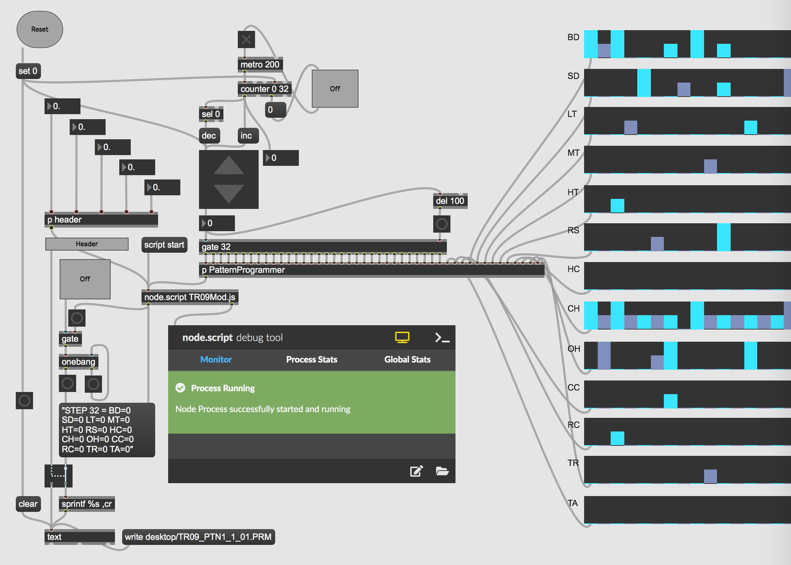

# MaxMSP_TR09_backupAsComposition
This repository investigates core elements of the popular Roland drummachine [TR09](https://www.roland.com/global/products/tr-09/) and in particulars its backupsystem of drum patterns. This feature of the TR09 enables patterns to be archived on the users computer as [.PRM-files](https://www.openthefile.net/extension/prm).
```
END_STEP	= 23
SCALE	= 2
SHUFFLE	= 50
FLAM	= 36
CHAIN	= 0
STEP 1	= BD=2 SD=0 LT=0 MT=0 HT=0 RS=0 HC=0 CH=0 OH=0 CC=0 RC=1 TR=1 TA=0
STEP 2	= BD=0 SD=0 LT=0 MT=0 HT=0 RS=0 HC=0 CH=0 OH=0 CC=0 RC=0 TR=0 TA=0
STEP 3	= BD=0 SD=0 LT=0 MT=0 HT=0 RS=0 HC=0 CH=0 OH=0 CC=0 RC=0 TR=0 TA=0
STEP 4	= BD=0 SD=0 LT=0 MT=0 HT=0 RS=0 HC=0 CH=2 OH=0 CC=0 RC=0 TR=0 TA=0
STEP 5	= BD=0 SD=0 LT=0 MT=0 HT=0 RS=0 HC=0 CH=0 OH=0 CC=0 RC=0 TR=0 TA=0
STEP 6	= BD=0 SD=1 LT=0 MT=0 HT=0 RS=0 HC=0 CH=0 OH=0 CC=0 RC=0 TR=0 TA=0
STEP 7	= BD=0 SD=0 LT=1 MT=0 HT=0 RS=0 HC=0 CH=0 OH=1 CC=0 RC=0 TR=0 TA=0
STEP 8	= BD=0 SD=0 LT=0 MT=0 HT=0 RS=0 HC=0 CH=0 OH=0 CC=0 RC=0 TR=0 TA=0
STEP 9	= BD=0 SD=0 LT=0 MT=0 HT=0 RS=0 HC=0 CH=2 OH=0 CC=0 RC=0 TR=1 TA=0
STEP 10	= BD=0 SD=0 LT=0 MT=0 HT=0 RS=0 HC=0 CH=0 OH=0 CC=0 RC=0 TR=0 TA=0
STEP 11	= BD=0 SD=0 LT=0 MT=0 HT=0 RS=0 HC=0 CH=0 OH=0 CC=0 RC=0 TR=0 TA=0
STEP 12	= BD=0 SD=1 LT=0 MT=0 HT=0 RS=0 HC=1 CH=2 OH=0 CC=0 RC=0 TR=0 TA=0
STEP 13	= BD=2 SD=0 LT=0 MT=0 HT=0 RS=0 HC=0 CH=0 OH=1 CC=0 RC=1 TR=0 TA=0
STEP 14	= BD=0 SD=0 LT=0 MT=0 HT=0 RS=0 HC=0 CH=0 OH=0 CC=0 RC=0 TR=0 TA=0
STEP 15	= BD=0 SD=1 LT=0 MT=0 HT=0 RS=0 HC=0 CH=0 OH=0 CC=0 RC=0 TR=0 TA=0
STEP 16	= BD=0 SD=0 LT=1 MT=0 HT=0 RS=0 HC=0 CH=1 OH=0 CC=0 RC=0 TR=0 TA=0
STEP 17	= BD=0 SD=0 LT=0 MT=0 HT=0 RS=0 HC=0 CH=0 OH=0 CC=0 RC=0 TR=1 TA=0
STEP 18	= BD=0 SD=0 LT=0 MT=0 HT=0 RS=0 HC=0 CH=0 OH=1 CC=0 RC=0 TR=0 TA=0
STEP 19	= BD=0 SD=0 LT=0 MT=0 HT=0 RS=0 HC=0 CH=0 OH=0 CC=0 RC=0 TR=0 TA=0
STEP 20	= BD=0 SD=0 LT=0 MT=0 HT=0 RS=0 HC=0 CH=0 OH=0 CC=0 RC=0 TR=0 TA=0
STEP 21	= BD=0 SD=0 LT=0 MT=0 HT=0 RS=0 HC=0 CH=0 OH=0 CC=0 RC=0 TR=0 TA=0
STEP 22	= BD=0 SD=0 LT=0 MT=0 HT=0 RS=0 HC=0 CH=2 OH=0 CC=0 RC=0 TR=0 TA=0
STEP 23	= BD=0 SD=0 LT=0 MT=0 HT=0 RS=0 HC=0 CH=0 OH=0 CC=0 RC=0 TR=0 TA=0
STEP 24	= BD=0 SD=0 LT=0 MT=0 HT=0 RS=0 HC=0 CH=0 OH=0 CC=0 RC=0 TR=0 TA=0
STEP 25	= BD=0 SD=0 LT=0 MT=0 HT=0 RS=0 HC=0 CH=0 OH=0 CC=0 RC=0 TR=0 TA=0
STEP 26	= BD=0 SD=0 LT=0 MT=0 HT=0 RS=0 HC=0 CH=0 OH=0 CC=0 RC=0 TR=0 TA=0
STEP 27	= BD=0 SD=0 LT=0 MT=0 HT=0 RS=0 HC=0 CH=0 OH=0 CC=0 RC=0 TR=0 TA=0
STEP 28	= BD=0 SD=0 LT=0 MT=0 HT=0 RS=0 HC=0 CH=0 OH=0 CC=0 RC=0 TR=0 TA=0
STEP 29	= BD=0 SD=0 LT=0 MT=0 HT=0 RS=0 HC=0 CH=0 OH=0 CC=0 RC=0 TR=0 TA=0
STEP 30	= BD=0 SD=0 LT=0 MT=0 HT=0 RS=0 HC=0 CH=0 OH=0 CC=0 RC=0 TR=0 TA=0
STEP 31	= BD=0 SD=0 LT=0 MT=0 HT=0 RS=0 HC=0 CH=0 OH=0 CC=0 RC=0 TR=0 TA=0
STEP 32	= BD=0 SD=0 LT=0 MT=0 HT=0 RS=0 HC=0 CH=0 OH=0 CC=0 RC=0 TR=0 TA=0
```
In order to access these files the user must first connect the TR09 with a USB cable to a computer. Secondly the user must restart the TR09 while holding down the start button. All the lights will come on, and this means the TR09 is awaiting connection to the computer, after which a drive will become visible on the computer containing the .PRM-files.

However what if it was possible to mod this feature and transform its function into a more constructive rather than archival mode of operation? A postdigital, postphenomenological interaction between user and systems. what sort of sonic possibility would arise from this approach from a compositional perspective?

## PRM-file generator using Node for Max
The development of this patch was centered around the structure of the .PRM files in which the patterns of TR09 is stored. In order to be able to generate your own .PRM files I used the Node for Max objects in Max/MSP as a way to create max messages with variables of the various percussive elements as well as the initial setups of shuffle and sequencer length etc. I created the javaScript file would be accessable from within Max via the "node.script TR09Mod.js".

```
const maxApi = require('max-api');

maxApi.addHandler('header', (end_Step, scale, shuffle, flam, chain) => {
  let v_End_Step = `END_STEP	= ${end_Step} \n`;
  let v_Scale = `SCALE	= ${scale} \n`;
  let v_Shuffle = `SHUFFLE	= ${shuffle} \n`;
  let v_Flam = `FLAM	= ${flam} \n`;
  let v_Chain = `CHAIN	= ${chain} \n`;
  maxApi.outlet(v_End_Step+v_Scale+v_Shuffle+v_Flam+v_Chain);
});

maxApi.addHandler('Step_1', (BD_1, SD_1, LT_1, MT_1, HT_1, RS_1, HC_1, CH_1, OH_1, CC_1, RC_1, TR_1, TA_1) => {
   maxApi.outlet(`STEP 1	= BD=${BD_1} SD=${SD_1} LT=${LT_1} MT=${MT_1} HT=${HT_1} RS=${RS_1} HC=${HC_1} CH=${CH_1} OH=${OH_1} CC=${CC_1} RC=${RC_1} TR=${TR_1} TA=${TA_1}`);
});

maxApi.addHandler('Step_2', (BD_2, SD_2, LT_2, MT_2, HT_2, RS_2, HC_2, CH_2, OH_2, CC_2, RC_2, TR_2, TA_2) => {
   maxApi.outlet(`STEP 2	= BD=${BD_2} SD=${SD_2} LT=${LT_2} MT=${MT_2} HT=${HT_2} RS=${RS_2} HC=${HC_2} CH=${CH_2} OH=${OH_2} CC=${CC_2} RC=${RC_2} TR=${TR_2} TA=${TA_2}`);
});

maxApi.addHandler('Step_3', (BD_3, SD_3, LT_3, MT_3, HT_3, RS_3, HC_3, CH_3, OH_3, CC_3, RC_3, TR_3, TA_3) => {
   maxApi.outlet(`STEP 3	= BD=${BD_3} SD=${SD_3} LT=${LT_3} MT=${MT_3} HT=${HT_3} RS=${RS_3} HC=${HC_3} CH=${CH_3} OH=${OH_3} CC=${CC_3} RC=${RC_3} TR=${TR_3} TA=${TA_3}`);
});

maxApi.addHandler('Step_4', (BD_4, SD_4, LT_4, MT_4, HT_4, RS_4, HC_4, CH_4, OH_4, CC_4, RC_4, TR_4, TA_4) => {
   maxApi.outlet(`STEP 4	= BD=${BD_4} SD=${SD_4} LT=${LT_4} MT=${MT_4} HT=${HT_4} RS=${RS_4} HC=${HC_4} CH=${CH_4} OH=${OH_4} CC=${CC_4} RC=${RC_4} TR=${TR_4} TA=${TA_4}`);
});

maxApi.addHandler('Step_5', (BD_5, SD_5, LT_5, MT_5, HT_5, RS_5, HC_5, CH_5, OH_5, CC_5, RC_5, TR_5, TA_5) => {
   maxApi.outlet(`STEP 5	= BD=${BD_5} SD=${SD_5} LT=${LT_5} MT=${MT_5} HT=${HT_5} RS=${RS_5} HC=${HC_5} CH=${CH_5} OH=${OH_5} CC=${CC_5} RC=${RC_5} TR=${TR_5} TA=${TA_5}`);
});

maxApi.addHandler('Step_6', (BD_6, SD_6, LT_6, MT_6, HT_6, RS_6, HC_6, CH_6, OH_6, CC_6, RC_6, TR_6, TA_6) => {
   maxApi.outlet(`STEP 6	= BD=${BD_6} SD=${SD_6} LT=${LT_6} MT=${MT_6} HT=${HT_6} RS=${RS_6} HC=${HC_6} CH=${CH_6} OH=${OH_6} CC=${CC_6} RC=${RC_6} TR=${TR_6} TA=${TA_6}`);
});

maxApi.addHandler('Step_7', (BD_7, SD_7, LT_7, MT_7, HT_7, RS_7, HC_7, CH_7, OH_7, CC_7, RC_7, TR_7, TA_7) => {
   maxApi.outlet(`STEP 7	= BD=${BD_7} SD=${SD_7} LT=${LT_7} MT=${MT_7} HT=${HT_7} RS=${RS_7} HC=${HC_7} CH=${CH_7} OH=${OH_7} CC=${CC_7} RC=${RC_7} TR=${TR_7} TA=${TA_7}`);
});

maxApi.addHandler('Step_8', (BD_8, SD_8, LT_8, MT_8, HT_8, RS_8, HC_8, CH_8, OH_8, CC_8, RC_8, TR_8, TA_8) => {
   maxApi.outlet(`STEP 8	= BD=${BD_8} SD=${SD_8} LT=${LT_8} MT=${MT_8} HT=${HT_8} RS=${RS_8} HC=${HC_8} CH=${CH_8} OH=${OH_8} CC=${CC_8} RC=${RC_8} TR=${TR_8} TA=${TA_8}`);
});

maxApi.addHandler('Step_9', (BD_9, SD_9, LT_9, MT_9, HT_9, RS_9, HC_9, CH_9, OH_9, CC_9, RC_9, TR_9, TA_9) => {
   maxApi.outlet(`STEP 9	= BD=${BD_9} SD=${SD_9} LT=${LT_9} MT=${MT_9} HT=${HT_9} RS=${RS_9} HC=${HC_9} CH=${CH_9} OH=${OH_9} CC=${CC_9} RC=${RC_9} TR=${TR_9} TA=${TA_9}`);
});

maxApi.addHandler('Step_10', (BD_10, SD_10, LT_10, MT_10, HT_10, RS_10, HC_10, CH_10, OH_10, CC_10, RC_10, TR_10, TA_10) => {
   maxApi.outlet(`STEP 10	= BD=${BD_10} SD=${SD_10} LT=${LT_10} MT=${MT_10} HT=${HT_10} RS=${RS_10} HC=${HC_10} CH=${CH_10} OH=${OH_10} CC=${CC_10} RC=${RC_10} TR=${TR_10} TA=${TA_10}`);
});

maxApi.addHandler('Step_11', (BD_11, SD_11, LT_11, MT_11, HT_11, RS_11, HC_11, CH_11, OH_11, CC_11, RC_11, TR_11, TA_11) => {
   maxApi.outlet(`STEP 11	= BD=${BD_11} SD=${SD_11} LT=${LT_11} MT=${MT_11} HT=${HT_11} RS=${RS_11} HC=${HC_11} CH=${CH_11} OH=${OH_11} CC=${CC_11} RC=${RC_11} TR=${TR_11} TA=${TA_11}`);
});

maxApi.addHandler('Step_12', (BD_12, SD_12, LT_12, MT_12, HT_12, RS_12, HC_12, CH_12, OH_12, CC_12, RC_12, TR_12, TA_12) => {
   maxApi.outlet(`STEP 12	= BD=${BD_12} SD=${SD_12} LT=${LT_12} MT=${MT_12} HT=${HT_12} RS=${RS_12} HC=${HC_12} CH=${CH_12} OH=${OH_12} CC=${CC_12} RC=${RC_12} TR=${TR_12} TA=${TA_12}`);
});

maxApi.addHandler('Step_13', (BD_13, SD_13, LT_13, MT_13, HT_13, RS_13, HC_13, CH_13, OH_13, CC_13, RC_13, TR_13, TA_13) => {
   maxApi.outlet(`STEP 13	= BD=${BD_13} SD=${SD_13} LT=${LT_13} MT=${MT_13} HT=${HT_13} RS=${RS_13} HC=${HC_13} CH=${CH_13} OH=${OH_13} CC=${CC_13} RC=${RC_13} TR=${TR_13} TA=${TA_13}`);
});

maxApi.addHandler('Step_14', (BD_14, SD_14, LT_14, MT_14, HT_14, RS_14, HC_14, CH_14, OH_14, CC_14, RC_14, TR_14, TA_14) => {
   maxApi.outlet(`STEP 14	= BD=${BD_14} SD=${SD_14} LT=${LT_14} MT=${MT_14} HT=${HT_14} RS=${RS_14} HC=${HC_14} CH=${CH_14} OH=${OH_14} CC=${CC_14} RC=${RC_14} TR=${TR_14} TA=${TA_14}`);
});

maxApi.addHandler('Step_15', (BD_15, SD_15, LT_15, MT_15, HT_15, RS_15, HC_15, CH_15, OH_15, CC_15, RC_15, TR_15, TA_15) => {
   maxApi.outlet(`STEP 15	= BD=${BD_15} SD=${SD_15} LT=${LT_15} MT=${MT_15} HT=${HT_15} RS=${RS_15} HC=${HC_15} CH=${CH_15} OH=${OH_15} CC=${CC_15} RC=${RC_15} TR=${TR_15} TA=${TA_15}`);
});

maxApi.addHandler('Step_16', (BD_16, SD_16, LT_16, MT_16, HT_16, RS_16, HC_16, CH_16, OH_16, CC_16, RC_16, TR_16, TA_16) => {
   maxApi.outlet(`STEP 16	= BD=${BD_16} SD=${SD_16} LT=${LT_16} MT=${MT_16} HT=${HT_16} RS=${RS_16} HC=${HC_16} CH=${CH_16} OH=${OH_16} CC=${CC_16} RC=${RC_16} TR=${TR_16} TA=${TA_16}`);
});

maxApi.addHandler('Step_17', (BD_17, SD_17, LT_17, MT_17, HT_17, RS_17, HC_17, CH_17, OH_17, CC_17, RC_17, TR_17, TA_17) => {
   maxApi.outlet(`STEP 17	= BD=${BD_17} SD=${SD_17} LT=${LT_17} MT=${MT_17} HT=${HT_17} RS=${RS_17} HC=${HC_17} CH=${CH_17} OH=${OH_17} CC=${CC_17} RC=${RC_17} TR=${TR_17} TA=${TA_17}`);
});

maxApi.addHandler('Step_18', (BD_18, SD_18, LT_18, MT_18, HT_18, RS_18, HC_18, CH_18, OH_18, CC_18, RC_18, TR_18, TA_18) => {
   maxApi.outlet(`STEP 18	= BD=${BD_18} SD=${SD_18} LT=${LT_18} MT=${MT_18} HT=${HT_18} RS=${RS_18} HC=${HC_18} CH=${CH_18} OH=${OH_18} CC=${CC_18} RC=${RC_18} TR=${TR_18} TA=${TA_18}`);
});

maxApi.addHandler('Step_19', (BD_19, SD_19, LT_19, MT_19, HT_19, RS_19, HC_19, CH_19, OH_19, CC_19, RC_19, TR_19, TA_19) => {
   maxApi.outlet(`STEP 19	= BD=${BD_19} SD=${SD_19} LT=${LT_19} MT=${MT_19} HT=${HT_19} RS=${RS_19} HC=${HC_19} CH=${CH_19} OH=${OH_19} CC=${CC_19} RC=${RC_19} TR=${TR_19} TA=${TA_19}`);
});

maxApi.addHandler('Step_20', (BD_20, SD_20, LT_20, MT_20, HT_20, RS_20, HC_20, CH_20, OH_20, CC_20, RC_20, TR_20, TA_20) => {
   maxApi.outlet(`STEP 20	= BD=${BD_20} SD=${SD_20} LT=${LT_20} MT=${MT_20} HT=${HT_20} RS=${RS_20} HC=${HC_20} CH=${CH_20} OH=${OH_20} CC=${CC_20} RC=${RC_20} TR=${TR_20} TA=${TA_20}`);
});

maxApi.addHandler('Step_21', (BD_21, SD_21, LT_21, MT_21, HT_21, RS_21, HC_21, CH_21, OH_21, CC_21, RC_21, TR_21, TA_21) => {
   maxApi.outlet(`STEP 21	= BD=${BD_21} SD=${SD_21} LT=${LT_21} MT=${MT_21} HT=${HT_21} RS=${RS_21} HC=${HC_21} CH=${CH_21} OH=${OH_21} CC=${CC_21} RC=${RC_21} TR=${TR_21} TA=${TA_21}`);
});

maxApi.addHandler('Step_22', (BD_22, SD_22, LT_22, MT_22, HT_22, RS_22, HC_22, CH_22, OH_22, CC_22, RC_22, TR_22, TA_22) => {
   maxApi.outlet(`STEP 22	= BD=${BD_22} SD=${SD_22} LT=${LT_22} MT=${MT_22} HT=${HT_22} RS=${RS_22} HC=${HC_22} CH=${CH_22} OH=${OH_22} CC=${CC_22} RC=${RC_22} TR=${TR_22} TA=${TA_22}`);
});

maxApi.addHandler('Step_23', (BD_23, SD_23, LT_23, MT_23, HT_23, RS_23, HC_23, CH_23, OH_23, CC_23, RC_23, TR_23, TA_23) => {
   maxApi.outlet(`STEP 23	= BD=${BD_23} SD=${SD_23} LT=${LT_23} MT=${MT_23} HT=${HT_23} RS=${RS_23} HC=${HC_23} CH=${CH_23} OH=${OH_23} CC=${CC_23} RC=${RC_23} TR=${TR_23} TA=${TA_23}`);
});

maxApi.addHandler('Step_24', (BD_24, SD_24, LT_24, MT_24, HT_24, RS_24, HC_24, CH_24, OH_24, CC_24, RC_24, TR_24, TA_24) => {
   maxApi.outlet(`STEP 24	= BD=${BD_24} SD=${SD_24} LT=${LT_24} MT=${MT_24} HT=${HT_24} RS=${RS_24} HC=${HC_24} CH=${CH_24} OH=${OH_24} CC=${CC_24} RC=${RC_24} TR=${TR_24} TA=${TA_24}`);
});

maxApi.addHandler('Step_25', (BD_25, SD_25, LT_25, MT_25, HT_25, RS_25, HC_25, CH_25, OH_25, CC_25, RC_25, TR_25, TA_25) => {
   maxApi.outlet(`STEP 25	= BD=${BD_25} SD=${SD_25} LT=${LT_25} MT=${MT_25} HT=${HT_25} RS=${RS_25} HC=${HC_25} CH=${CH_25} OH=${OH_25} CC=${CC_25} RC=${RC_25} TR=${TR_25} TA=${TA_25}`);
});

maxApi.addHandler('Step_26', (BD_26, SD_26, LT_26, MT_26, HT_26, RS_26, HC_26, CH_26, OH_26, CC_26, RC_26, TR_26, TA_26) => {
   maxApi.outlet(`STEP 26	= BD=${BD_26} SD=${SD_26} LT=${LT_26} MT=${MT_26} HT=${HT_26} RS=${RS_26} HC=${HC_26} CH=${CH_26} OH=${OH_26} CC=${CC_26} RC=${RC_26} TR=${TR_26} TA=${TA_26}`);
});

maxApi.addHandler('Step_27', (BD_27, SD_27, LT_27, MT_27, HT_27, RS_27, HC_27, CH_27, OH_27, CC_27, RC_27, TR_27, TA_27) => {
   maxApi.outlet(`STEP 27	= BD=${BD_27} SD=${SD_27} LT=${LT_27} MT=${MT_27} HT=${HT_27} RS=${RS_27} HC=${HC_27} CH=${CH_27} OH=${OH_27} CC=${CC_27} RC=${RC_27} TR=${TR_27} TA=${TA_27}`);
});

maxApi.addHandler('Step_28', (BD_28, SD_28, LT_28, MT_28, HT_28, RS_28, HC_28, CH_28, OH_28, CC_28, RC_28, TR_28, TA_28) => {
   maxApi.outlet(`STEP 28	= BD=${BD_28} SD=${SD_28} LT=${LT_28} MT=${MT_28} HT=${HT_28} RS=${RS_28} HC=${HC_28} CH=${CH_28} OH=${OH_28} CC=${CC_28} RC=${RC_28} TR=${TR_28} TA=${TA_28}`);
});

maxApi.addHandler('Step_29', (BD_29, SD_29, LT_29, MT_29, HT_29, RS_29, HC_29, CH_29, OH_29, CC_29, RC_29, TR_29, TA_29) => {
   maxApi.outlet(`STEP 29	= BD=${BD_29} SD=${SD_29} LT=${LT_29} MT=${MT_29} HT=${HT_29} RS=${RS_29} HC=${HC_29} CH=${CH_29} OH=${OH_29} CC=${CC_29} RC=${RC_29} TR=${TR_29} TA=${TA_29}`);
});

maxApi.addHandler('Step_30', (BD_30, SD_30, LT_30, MT_30, HT_30, RS_30, HC_30, CH_30, OH_30, CC_30, RC_30, TR_30, TA_30) => {
   maxApi.outlet(`STEP 30	= BD=${BD_30} SD=${SD_30} LT=${LT_30} MT=${MT_30} HT=${HT_30} RS=${RS_30} HC=${HC_30} CH=${CH_30} OH=${OH_30} CC=${CC_30} RC=${RC_30} TR=${TR_30} TA=${TA_30}`);
});

maxApi.addHandler('Step_31', (BD_31, SD_31, LT_31, MT_31, HT_31, RS_31, HC_31, CH_31, OH_31, CC_31, RC_31, TR_31, TA_31) => {
   maxApi.outlet(`STEP 31	= BD=${BD_31} SD=${SD_31} LT=${LT_31} MT=${MT_31} HT=${HT_31} RS=${RS_31} HC=${HC_31} CH=${CH_31} OH=${OH_31} CC=${CC_31} RC=${RC_31} TR=${TR_31} TA=${TA_31}`);
});

maxApi.addHandler('Step_32', (BD_32, SD_32, LT_32, MT_32, HT_32, RS_32, HC_32, CH_32, OH_32, CC_32, RC_32, TR_32, TA_32) => {
   maxApi.outlet(`STEP 32	= BD=${BD_32} SD=${SD_32} LT=${LT_32} MT=${MT_32} HT=${HT_32} RS=${RS_32} HC=${HC_32} CH=${CH_32} OH=${OH_32} CC=${CC_32} RC=${RC_32} TR=${TR_32} TA=${TA_32}`);
});

```
## Patcher
Surrounding the node.script object is other max objects that serve to assemble the generated messages from the node script into the max text object as well as multisliders as a way to easily set the many parameters.

<details>
  <summary>Max-patcher</summary>
<pre><code>
----------begin_max5_patcher----------
17409.3oc6c+8aiicjnG+YO+UXzH6a8su72T5BjGRl8BLOjrIXlA39vjfFps
U6VYrkLrjmerKx+6WIRIaIJQ4SQdpCK69axld1QrsYwpN5HxhG8g+OeyEu6S
K9soKe2k+et7mt7hK9e9lKtn5k17BWr8e+h2c2je6pamrr5u16lO8WW7o+06
de8lVM82VU8x2e4eexpUSeX9e+gE27vj6ta5C696L65p+Fq+o9ekLJZ2qN+w
6lM+1oqp9slku8Uuexpq9xr427wGld0p5vJobzGhd+koE4a9GYih27ORR9Pz
k+ym+Us3wU69cEu8UqeoU+98Sq+87t28zOP0dYc.VeTt8v7h284Y2N8Wl9vx
YKlu2unKd2j6ueuW9h89Q1ja9WKp9EM58O8RylW+RwO8ROL8Wl8zu1me4IOr
9fc05izGenJHe2uUj8tm+8r3504yGmU8CU+h+6uYWLUUPlO4toKuexU0+vap
a617younMoqp+nHKpNCF8btac09laWb0OOspFEs6EWb+z4yle+CSWNc9pIq1
F4Os4qm94IOd6pO94EyWsb1+c0tOdcE4Ta+yaCuStwMG.Uw9e5gYSt8on+lG
lc8h4aBhCpCad4c6te5x3pwCa9ymOXp9aLex8m3Gd8vu04jV13x0GjOt7SSd
XSY5S2VsGR1swUKVb6ga5oetam94Ua278ylOuQVb0h6aeiOL6luble1OsX8F
u6b+tq1xxO9375s9w0CHV8wkS9kCy1qlb6saeK6g+5+sIymc2jUSWMqtDjD8
zFmNex5Czur7pGVb6sGb7Vuke4Da450ivuZ5uN65UeoZGs+fg0+0mc+tAQu6
op70ytY5xUG9ZqlbyxCekkq985j9duzieZ66f+3po2c+sqOJN7uv52ZLa4pk
eYwutb6ewcCz1OA777d6+N58m+6fW+byCd3bgqKISt5mubV+9u6+qd+oPSS2
eKGLMZ7da3DyjFGsdZyj70uoItnZVz7wGMY5IlPMMYuMczrpylu5cu+s5+3x
+4ti7+827M69+48u1Fwjj00QLiSGWMIaTDCW95Y3RY2mfIM4CqmeIIJkwKe0
LdIMpGefTZ03kQ4Ld4qm4Wh663k3n0WSXNCX9JY.S7n9NfY73zpS7kALecLf
Iu2CXhJ9PICX9pY.SReGvLJlOQ5qmwKQi663kxDNk2uhFuTz2wKEooL+xWOi
WR663k7Lle4qnwK8tELY4ELdwPiWt+xeX0z6+XZRKk73n7yzl1zyWzSiJ2Tk
GmT2s1zLGp4wmqj+tC9Aab60OLCz5sYusa0die7ScK2a41tela89Ke62a6Vv
evsg2gaEeiaGe91anRZq2Q9Vuq7Nbm4c4ty+h2gdGuK8m4N061cq+Eti8u3c
s+Euy8uvcu+kuC9u3cw2g6juK2MeI2Q+ybW8ew6r+4u69m+N7e96x+YuS+sc
29O8c7uk65uS24eGu6+mdE.zbhllyhez1aLa9UKt6toa9jhC+67zT5+sGWc+
iqtb0hK+uVOsxk+PUtp4e68mhOq4Fa6C1a8C2SqllIMY6a9plsIo4jMGOWez
9a7oOm6vOqquYqpCjyczmb1i9nW9nOa75C6n3w4YEI4QQQ4Qid+kipWLYQ69
yWHSzLIexS14neG6FIr4X4G+SGcPN+5o+V8GSag7bbuyyE6xyaxxQQq+2Gh7
722ddNwB44ndmmS2kmSK2joyRRGf772+ssmmiMPddbuSyQ6RyUyZDkNJd.Ry
e6YRyVX54Q8MMudL71zbbUdNMc7.jl+aeWqo4wFHKW16rb1trb0TyQIiKFhA
ysmkGYfrbQuyxwayxoiplYNIOa.xxeW6SYTZfrbdeyxUqRnprbURNJINYH97
uen0rbgAxxY8NKmuKKWeVywECw7xe2O1ZVN2.Y4zdmkS1kkqOm43jxAHK+Wa
OKmYfrbuuBv3cWAX51oLFMDWYxeo8rrIt.vdmk2c8eoIau.vgXd4e3+r0rbH
t7uiZk+g8945o2tYUzetxP54Gtm7xEhx593Gusoxmpo9cI0+oIyuYu66ghIw
O83pUKle1jzQiVuexCSta5poO7w5VWdpAsR6aVchLtLoJEls6Oe8jHegQiKu
+g0ue5y6tESW9eLyk+uy1rtWnWkotzrxcSiDuYoZljuctiBeMNNLo9WpKvmn
ef6c8d48skuO0zy8mLtndfbtgZ+6Kll99ykl5cmwyJdajlNQ231KMk16zTZ6
oohWQoou8roojdmlhdajlNQ2v1KME22zzSs7609noyllh5cZJ6sQZ56N2a5J
F26zT7aizzIZnzdooQ8MM8bWydc+IcmniP6klJ6cZJ+sQZ5ud1zTQuSSIuMd
S2e4roodeV3wuQNK7SzTk8RS8e8o7F4rv+ymMMk1+kwyqizz583mdh8oSlJN
5THW+yO6tGu6zM35kary573te7HucgyUseHtt0kqyuiGWDMNcyWFPGZBQxK1
Dh2Gz9.8hUjHCWQJ9ZrhjO1vUjzuJqHiLbEI5qxJRocqHO2jiuppHEFthj8U
YEI2vUj3uJqHY1sh7bWh9pphjZ3JR9WkUjDCWQR9prhX3qYO9qxqYO2vWyd7
WkWydlgO6232hWy9K+ksJs2eOfZj3B9BZ7O29BZLDeOqpC3yliyh7VmsSFW+
exGsQCzQennLcTR4dunyI9nyjR6TB8vuu52Na9K8sFt53byeuymsWt3wGtZ2
ngsey0t73itqmtb0r4O8M8+mdtmTa9K2oABcM.GII.KGf.rTR.VL.A3la.hy
QX0hc8D+sW7v003ZDa3XeyBB8x3j1C9nvF7QuhS7QxS7wlIwK4sj4CvaIyG+
5cjgrXudjQjUFYjO5Ubhej3D+Xyj2KeEm2KEm2GYl7dwq37dg37doYx64uhy
64hy6ElIum8JNumINumal7d5q37dp37dlYx6Iuhy6Ihy6olIu+J9ZpykeM0l
4RpyeEeI04c3RpMSdWxUTmM.WQc1q3SzMS9I5ZlKnVx4rr6CZCZ.J4C228IR
AM.k7of6l5NnAXERDxGeF3XT1GHODE51dmaKwX0c5Z.BRAwXwfLbTRktXPxg
U2HXmiwrhAIFkLsy3gHBkDfubYduMtuj5uaC00W+wZxu+3jUqdX1mdbU8ca8
DQZ23l9laW7oI21vE51Do9aN9.HLp+G2t5+i5q5+iFkh5+n9Op+i5+M1Jp+2
g0IEp+i5+GuRyP8eT+G0+Q8eT+G0+u.0+alkQ8eT+G0+Q8eT+G0+alkQ8+fb
gIn9uGxxn9uGRhn9+Pn9eLp+i5+n9Op+i5+cMMg5+n9Op+2HMg5+n9Op+G3z
Dp+i5+n9efSSn9Op+i5+duhf5+Vqhf5+Vqhf5+Fqhf5+lqhf5+Vqhf5+Fqhf
5+lqhf5+Vqhf5+Fqhf5+lqhf5+Vqhf5+cbYMh5+n9Op+i5+dL.Q8eT+G0+Q8
eT+G0+Q8eT+G0+Q8e+E6n9Op+i5+n9Op+i5+n9u+hcT+G0+Q8+9Gfn9eeCPT
+G0+Q8eIQHp+6iHD0+Cq5+Qsq9+3dq9eVLp+i5+n9Op+2Xqn9eGVmTn9Op+e
7JMC0+Q8eT+G0+Q8eT++BT+uYVF0+Q8eT+G0+Q8eT+uYVF0+CxElf5+dHKi5
+dHIh5+Cg5+Qn9Op+i5+n9Op+20zDp+i5+n9eizDp+i5+n9efSSn9Op+i5+A
NMg5+n9Op+68JBp+asJBp+asJBp+arJBp+atJBp+asJBp+arJBp+atJBp+as
JBp+arJBp+atJBp+asJBp+2wk0Hp+i5+n9Op+6w.D0+Q8eT+G0+Q8eT+G0+Q
8eT+G0+8Wri5+n9Op+i5+n9Op+i5+9K1Q8eT+G0+6e.h5+8M.Q8eT+G0+kDg
n9uOhPT+Onp+mLtU0+O3KrS2T+OJA0+Q8eT+G0+arUT+uCqSJT+G0+Odklg5
+n9Op+i5+n9Op+eAp+2LKi5+n9Op+i5+n9Op+2LKi5+A4BSP8eOjkQ8eOjDQ
8+AP8+jwn9Op+i5+n9Op+20zDp+i5+n9eizDp+i5+n9efSSn9Op+i5+ANMg5
+n9Op+68JBp+asJBp+asJBp+arJBp+atJBp+asJBp+arJBp+atJBp+asJBp+
arJBp+atJBp+asJBp+2wk0Hp+i5+n9Op+6w.D0+Q8eT+G0+Q8eT+G0+Q8eT+
G0+8Wri5+n9Op+i5+n9Op+i5+9K1Q8eT+G0+6e.h5+8M.Q8eT+G0+kDgn9uO
hPT+Orp+Opc0+i6q5+kEwn9Op+i5+n9eish5+cXcRg5+n9+wqzLT+G0+Q8eT
+G0+Q8+KP8+lYYT+G0+Q8eT+G0+Q8+lYYT+OHWXBp+6grLp+6gjHp+ODp+OB
0+Q8eT+G0+Q8+tllP8eT+G0+ajlP8eT+G0+CbZB0+Q8eT+OvoIT+G0+Q8euW
QP8eqUQP8eqUQP8eiUQP8eyUQP8eqUQP8eiUQP8eyUQP8eqUQP8eiUQP8eyU
QP8eqUQP8+NtrFQ8eT+G0+Q8eOFfn9Op+i5+n9Op+i5+n9Op+i5+n9u+hcT+
G0+Q8eT+G0+Q8eT+2ewNp+i5+n9e+CPT+uuAHp+i5+n9ujHD0+8QDh5+gU8+
x1U+Oo2p+mjf5+n9Op+i5+M1Jp+2g0IEp+i5+GuRyP8eT+G0+Q8eT+G0+u.0
+alkQ8eT+G0+Q8eT+G0+alkQ8+fbgIn9uGxxn9uGRhn9+Pn9eIp+i5+n9Op+
i5+cMMg5+n9Op+2HMg5+n9Op+G3zDp+i5+n9efSSn9Op+i5+duhf5+Vqhf5+
Vqhf5+Fqhf5+lqhf5+Vqhf5+Fqhf5+lqhf5+Vqhf5+Fqhf5+lqhf5+Vqhf5+
cbYMh5+n9Op+i5+dL.Q8eT+G0+Q8eT+G0+Q8eT+G0+Q8e+E6n9Op+i5+n9Op
+i5+n9u+hcT+G0+Q8+9Gfn9eeCPT+G0+Q8eIQHp+6iHD0+Cq5+Esq9eZeU+u
XTDp+i5+n9Op+2Xqn9eGVmTn9Op+e7JMC0+Q8eT+G0+Q8eT++BT+uYVF0+Q8
eT+G0+Q8eT+uYVF0+CxElf5+dHKi5+dHIh5+Cg5+En9Op+i5+n9Op+20zDp+
i5+n9eizDp+i5+n9efSSn9Op+i5+ANMg5+n9Op+68JBp+asJBp+asJBp+arJ
Bp+atJBp+asJBp+arJBp+atJBp+asJBp+arJBp+atJBp+asJBp+2wk0Hp+i5
+n9Op+6w.D0+Q8eT+G0+Q8eT+G0+Q8eT+G0+8Wri5+n9Op+i5+n9Op+i5+9K
1Q8eT+G0+6e.h5+8M.Q8eT+G0+kDgn9uOhPT+Orp+m2t5+Y8V8+rXT+G0+Q8
eT+uwVQ8+NrNoP8eT++3UZFp+i5+n9Op+elSX9nbLj+C4+P9eXxxP9eHxxP9
eHxxP9eHxxP9eHxxP9ePtpDH+2CYYH+2CIQH+eHH+OGx+g7eH+Gx+g7+tllf
7eH+Gx+ajlf7eH+Gx+CbZBx+g7eH+OvoIH+Gx+g7euWQf7eqUQf7eqUQf7ei
UQf7eyUQf7eqUQf7eiUQf7eyUQf7eqUQf7eiUQf7eyUQf7eqUQf7+NtrFg7e
H+Gx+g7eOFfP9Oj+C4+P9Oj+C4+P9Oj+C4+P9u+hcH+Gx+g7eH+Gx+g7eH+2
ewNj+C4+P9e+CPH+uuAHj+C4+P9ujHDx+8QDB4+gk7+r1I+Ou2j+GkB4+P9O
j+C4+M1Jj+2g0IEj+C4+GuRyf7eH+Gx+g7eoPoi5+n9Op+GjrLp+GhrLp+Gh
rLp+GhrLp+GhrLp+GjKLA0+8PVF0+8PRD0+GB0+yP8eT+G0+Q8eT+uqoIT+G
0+Q8+FoIT+G0+Q8+.mlP8eT+G0+CbZB0+Q8eT+26UDT+2ZUDT+2ZUDT+2XUD
T+2bUDT+2ZUDT+2XUDT+2bUDT+2ZUDT+2XUDT+2bUDT+2ZUDT+uiKqQT+G0+
Q8eT+2iAHp+i5+n9Op+i5+n9Op+i5+n9Op+6uXG0+Q8eT+G0+Q8eT+G0+8Wr
i5+n9Op+2+.D0+6a.h5+n9Op+KIBQ8eeDgn9eXU+Osc0+K5q5+4EYn9Op+i5
+n9eish5+cXcRg5+n9+wqzLT+G0+Q8eT+G0+Q8+KP8+lYYT+G0+Q8eT+G0+Q
8+lYYT+OHWXBp+6grLp+6gjHp+ODp+mh5+n9Op+i5+n9eWSSn9Op+i5+MRSn
9Op+i5+ANMg5+n9Op+G3zDp+i5+n9u2qHn9u0pHn9u0pHn9uwpHn9u4pHn9u
0pHn9uwpHn9u4pHn9u0pHn9uwpHn9u4pHn9u0pHn9eGWVin9Op+i5+n9uGCP
T+G0+Q8eT+G0+Q8eT+G0+Q8eT+2ewNp+i5+n9Op+i5+n9Op+6uXG0+Q8eT+u
+AHp+22.D0+Q8eT+WRDh5+9HBQ8+vp9eR6p+W1a0+SRP8eT+G0+Q8+FaE0+6
v5jB0+Q8+iWoYn9Op+i5+n9Op+i5+Wf5+Myxn9Op+i5+n9Op+i5+Myxn9ePt
vDT+2CYYT+2CIQT+eHT+OA0+Q8eT+G0+Q8+tllP8eT+G0+ajlP8eT+G0+CbZ
B0+Q8eT+OvoIT+G0+Q8euWQP8eqUQP8eqUQP8eiUQP8eyUQP8eqUQP8eiUQP
8eyUQP8eqUQP8eiUQP8eyUQP8eqUQP8+NtrFQ8eT+G0+Q8eOFfn9Op+i5+n9
Op+i5+n9Op+i5+n9u+hcT+G0+Q8eT+G0+Q8eT+2ewNp+i5+n9e+CPT+uuAHp
+i5+n9ujHD0+8QDh5+gU8+31U+eTeU+OaTJp+i5+n9Op+2Xqn9eGVmTn9Op+
e7JMC0+Q8eT+G0+Q8eT++BT+uYVF0+Q8eT+G0+Q8eT+uYVF0+CxElf5+dHKi
5+dHIh5+Cg5+wn9Op+i5+n9Op+20zDp+i5+n9eizDp+i5+n9efSSn9Op+i5+
ANMg5+n9Op+68JBp+asJBp+asJBp+arJBp+atJBp+asJBp+arJBp+atJBp+a
sJBp+arJBp+atJBp+asJBp+2wk0Hp+i5+n9Op+6w.D0+Q8eT+G0+Q8eT+G0+
Q8eT+G0+8Wri5+n9Op+i5+n9Op+i5+9K1Q8eT+G0+6e.h5+8M.Q8eT+G0+kD
gn9uOhPT+Orp+G0t5+i6s5+YIn9Op+i5+n9eish5+cXcRg5+n9+wqzLT+G0+
Q8eT+G0+Q8+KP8+lYYT+G0+Q8eT+G0+Q8+lYYT+OHWXBp+6grLp+6gjHp+OD
p+Gg5+n9Op+i5+n9eWSSn9Op+i5+MRSn9Op+i5+ANMg5+n9Op+G3zDp+i5+n
9u2qHn9u0pHn9u0pHn9uwpHn9u4pHn9u0pHn9uwpHn9u4pHn9u0pHn9uwpHn
9u4pHn9u0pHn9eGWVin9Op+i5+n9uGCPT+G0+Q8eT+G0+Q8eT+G0+Q8eT+2e
wNp+i5+n9Op+i5+n9Op+6uXG0+Q8eT+u+AHp+22.D0+Q8eT+WRDh5+9HBQ8+
fp9e73VU++fud4cS8+nTT+G0+Q8eT+uwVQ8+NrNoP8eT++3UZFp+i5+n9Op+
i5+n9+En9eyrLp+i5+n9Op+i5+n9eyrLp+GjKLA0+8PVF0+8PRD0+G.0+iGi
5+n9Op+i5+n9eWSSn9Op+i5+MRSn9Op+i5+ANMg5+n9Op+G3zDp+i5+n9u2q
Hn9u0pHn9u0pHn9uwpHn9u4pHn9u0pHn9uwpHn9u4pHn9u0pHn9uwpHn9u4p
Hn9u0pHn9eGWVin9Op+i5+n9uGCPT+G0+Q8eT+G0+Q8eT+G0+Q8eT+2ewNp+
i5+n9Op+i5+n9Op+6uXG0+Q8eT+u+AHp+22.D0+Q8eT+WRDh5+9HBQ8+vp9+
n1U+Otup+mVDi5+n9Op+i5+M1Jp+2g0IEp+i5+GuRyP8eT+G0+Q8eT+G0+u.
0+alkQ8eT+G0+Q8eT+G0+alkQ8+fbgIn9uGxxn9uGRhn9+Pn9+HT+G0+Q8eT
+G0+6ZZB0+Q8eT+uQZB0+Q8eT+OvoIT+G0+Q8+.mlP8eT+G0+8dEA0+sVEA0
+sVEA0+MVEA0+MWEA0+sVEA0+MVEA0+MWEA0+sVEA0+MVEA0+MWEA0+sVEA0
+63xZD0+Q8eT+G0+8X.h5+n9Op+i5+n9Op+i5+n9Op+i5+9K1Q8eT+G0+Q8e
T+G0+Q8e+E6n9Op+i5+8O.Q8+9Ffn9Op+i5+RhPT+2GQHp+GV0+KaW8+jdq9
eRNp+i5+n9Op+2Xqn9eGVmTn9Op+e7JMC0+Q8eT+G0+Q8eT++BT+uYVF0+Q8
eT+G0+Q8eT+uYVF0+CxElf5+dHKi5+dHIh5+Cg5+kn9Op+i5+n9Op+20zDp+
i5+n9eizDp+i5+n9efSSn9Op+i5+ANMg5+n9Op+68JBp+asJBp+asJBp+arJ
Bp+atJBp+asJBp+arJBp+atJBp+asJBp+arJBp+atJBp+asJBp+2wk0Hp+i5
+n9Op+6w.D0+Q8eT+G0+Q8eT+G0+Q8eT+G0+8Wri5+n9Op+i5+n9Op+i5+9K
1Q8eT+G0+6e.h5+8M.Q8eT+G0+kDgn9uOhPT+Orp+Wzp5+Yi6r5+0fpLNJCz
+A8eP+Gz+arUP+uCKSJP+Gz+OdglA5+f9On+C5+f9On+eAn+2LKC5+f9On+C
5+f9On+2LKC5+A4BS.8eOjkA8eOjDA8+g.8+BP+Gz+A8eP+Gz+6ZZBz+A8eP
+uQZBz+A8eP+OvoIP+Gz+A8+.ml.8eP+Gz+8dEAz+sVEAz+sVEAz+MVEAz+M
WEAz+sVEAz+MVEAz+MWEAz+sVEAz+MVEAz+MWEAz+sVEAz+63xZDz+A8eP+G
z+8X.B5+f9On+C5+f9On+C5+f9On+C5+9K1A8eP+Gz+A8eP+Gz+A8e+E6f9O
n+C5+8O.A8+9Fff9On+C5+RhPP+2GQHn+GVz+yaE8+CV7OcA8+QE4f9On+C5
+f9eisB5+cXYRA5+f9+wKzLP+Gz+A8eP+Gz+A8+K.8+lYYP+Gz+A8eP+Gz+A
8+lYYP+OHWXBn+6grLn+6gjHn+ODn+mC5+f9On+C5+f9eWSSf9On+C5+MRSf
9On+C5+ANMA5+f9On+G3zDn+C5+f9u2qHf9u0pHf9u0pHf9uwpHf9u4pHf9u
0pHf9uwpHf9u4pHf9u0pHf9uwpHf9u4pHf9u0pHf9eGWVif9On+C5+f9uGCP
P+Gz+A8eP+Gz+A8eP+Gz+A8eP+2ewNn+C5+f9On+C5+f9On+6uXGz+A8eP+u
+AHn+22.Dz+A8eP+WRDB5+9HBA8+vh9eV6n+G2Wz+SRA8eP+Gz+A8+FaEz+6
vxjBz+A8+iWnYf9On+C5+f9On+C5+W.5+Myxf9On+C5+f9On+C5+Myxf9ePt
vDP+2CYYP+2CIQP+eHP+OCz+A8eP+Gz+A8+tll.8eP+Gz+ajl.8eP+Gz+CbZ
Bz+A8eP+OvoIP+Gz+A8euWQ.8eqUQ.8eqUQ.8eiUQ.8eyUQ.8eqUQ.8eiUQ.
8eyUQ.8eqUQ.8eiUQ.8eyUQ.8eqUQ.8+NtrFA8eP+Gz+A8eOFff9On+C5+f9
On+C5+f9On+C5+f9u+hcP+Gz+A8eP+Gz+A8eP+2ewNn+C5+f9e+CPP+uuAHn
+C5+f9ujHDz+8QDB5+gE8+z1Q+Oomn+WNJCz+A8eP+Gz+arUP+uCKSJP+Gz+
OdglA5+f9On+C5+f9On+eAn+2LKC5+f9On+C5+f9On+2LKC5+A4BS.8eOjkA
8eOjDA8+g.8+TP+Gz+A8eP+Gz+6ZZBz+A8eP+uQZBz+A8eP+OvoIP+Gz+A8+
.ml.8eP+Gz+8dEAz+sVEAz+sVEAz+MVEAz+MWEAz+sVEAz+MVEAz+MWEAz+s
VEAz+MVEAz+MWEAz+sVEAz+63xZDz+A8eP+Gz+8X.B5+f9On+C5+f9On+C5+
f9On+C5+9K1A8eP+Gz+A8eP+Gz+A8e+E6f9On+C5+8O.A8+9Fff9On+C5+Rh
PP+2GQHn+GVz+SZG8+z9h9eVJn+C5+f9On+2Xqf9eGVlTf9On+e7BMCz+A8e
P+Gz+A8eP++BP+uYVFz+A8eP+Gz+A8eP+uYVFz+CxEl.5+dHKC5+dHIB5+CA
5+If9On+C5+f9On+20zDn+C5+f9eizDn+C5+f9efSSf9On+C5+ANMA5+f9On
+68JBn+asJBn+asJBn+arJBn+atJBn+asJBn+arJBn+atJBn+asJBn+arJBn
+atJBn+asJBn+2wk0Hn+C5+f9On+6w.Dz+A8eP+Gz+A8eP+Gz+A8eP+Gz+8W
rC5+f9On+C5+f9On+C5+9K1A8eP+Gz+6e.B5+8M.A8eP+Gz+kDgf9uOhPP+O
rn+G2N5+Y8E8+nLP+Gz+A8eP+uwVA8+NrLo.8eP++3EZFn+C5+f9On+C5+f9
+Ef9eyrLn+C5+f9On+C5+f9eyrLn+GjKLAz+8PVFz+8PRDz+GBz+isM5+4f9
On+C5+mNMA5+f9On+G5QSf9On+C5+AdzDn+C5+f9eXSSf9On+C5+f9+vTQ.8
eqUQ.8eqUQ.8eiUQ.8eyUQ.8eqUQ.8eiUQ.8eyUQ.8eqUQ.8eiUQ.8eyUQ.8
eqUQ.8+NtrFA8eP+Gz+A8eOFff9On+C5+f9On+C5+f9On+C5+f9u+hcP+Gz+
A8eP+Gz+A8eP+2ewNn+C5+f9e+CPP+uuAHn+C5+f9ujHDz+8QDB5+gE8+n1Q
+Oumn+WTj.5+f9On+C5+M1Jn+2gkIEn+C5+GuPy.8eP+Gz+A8eP+Gz+u.z+a
lkA8eP+Gz+A8eP+Gz+alkA8+fbgIf9uGxxf9uGRhf9+Pf9ejsQ+u.z+A8eP+
+zoIP+Gz+A8+POZBz+A8eP+Ovil.8eP+Gz+CaZBz+A8eP+Gz+GlJBn+asJBn
+asJBn+arJBn+atJBn+asJBn+arJBn+atJBn+asJBn+arJBn+atJBn+asJBn
+2wk0Hn+C5+f9On+6w.Dz+A8eP+Gz+A8eP+Gz+A8eP+Gz+8WrC5+f9On+C5+
f9On+C5+9K1A8eP+Gz+6e.B5+8M.A8eP+Gz+kDgf9uOhPP+Onn+Otcy+K5q4
+IoX9Ol+i4+X9eish4+cXURg4+X9+wqyLL+Gy+w7eL+Gy+w7+Kv7+lYYL+Gy
+w7eL+Gy+w7+lYYL+OHWXBl+6grLl+6gjHl+O.l+O1xj+mLdLj+C4+P9+oSS
P9Oj+C4+gdzDj+C4+P9efGMA4+P9Oj+G1zDj+C4+P9Oj+OLUDH+2ZUDH+2ZU
DH+2XUDH+2bUDH+2ZUDH+2XUDH+2bUDH+2ZUDH+2XUDH+2bUDH+2ZUDH+uiq
pQH+Gx+g7eH+2iAHj+C4+P9Oj+C4+P9Oj+C4+P9Oj+6uXGx+g7eH+Gx+g7eH
+Gx+8WrC4+P9Oj+2+.Dx+6a.B4+P9Oj+KIBg7eeDgP9ePI+eTqj+mk2Sx+yG
kC4+P9Oj+C4+M1Jj+2gUIEj+C4+GuNyf7eH+Gx+g7eH+Gx+u.x+alkg7eH+G
x+g7eH+Gx+alkg7+fbgIP9uGxxP9uGRhP9+.P9+HH+Gx+g7eH+Gx+6ZZBx+g
7eH+uQZBx+g7eH+OvoIH+Gx+g7+.mlf7eH+Gx+8dEAx+sVEAx+sVEAx+MVEA
x+MWEAx+sVEAx+MVEAx+MWEAx+sVEAx+MVEAx+MWEAx+sVEAx+63pZDx+g7e
H+Gx+8X.B4+P9Oj+C4+P9Oj+C4+P9Oj+C4+9K1g7eH+Gx+g7eH+Gx+g7e+E6
P9Oj+C4+8O.g7+9FfP9Oj+C4+RhPH+2GQHj+GTx+Kam7+h9R9eVAj+C4+P9O
j+2XqP9eGVkTP9Oj+e75LCx+g7eH+Gx+g7eH++BH+uYVFx+g7eH+Gx+g7eH+
uYVFx+CxEl.4+dHKC4+dHIB4+C.4+kP9Oj+C4+P9Oj+20zDj+C4+P9eizDj+
C4+P9efSSP9Oj+C4+ANMA4+P9Oj+68JBj+asJBj+asJBj+arJBj+atJBj+as
JBj+arJBj+atJBj+asJBj+arJBj+atJBj+asJBj+2wU0Hj+C4+P9Oj+6w.Dx
+g7eH+Gx+g7eH+Gx+g7eH+Gx+8WrC4+P9Oj+C4+P9Oj+C4+9K1g7eH+Gx+6e
.B4+8M.g7eH+Gx+kDgP9uOhPH+Onj+WzN4+k8k7+nLH+Gx+g7eH+uwVg7+Nr
Jof7eH++30YFj+C4+P9Oj+C4+P9+EP9eyrLj+C4+P9Oj+C4+P9eyrLj+GjKL
Ax+8PVFx+8PRDx+G.x+Kf7eH+Gx+g7eH+uqoIH+Gx+g7+FoIH+Gx+g7+.mlf
7eH+Gx+CbZBx+g7eH+26UDH+2ZUDH+2ZUDH+2XUDH+2bUDH+2ZUDH+2XUDH+
2bUDH+2ZUDH+2XUDH+2bUDH+2ZUDH+uiqpQH+Gx+g7eH+2iAHj+C4+P9Oj+C
4+P9Oj+C4+P9Oj+6uXGx+g7eH+Gx+g7eH+Gx+8WrC4+P9Oj+2+.Dx+6a.B4+
P9Oj+KIBg7eeDgP9ePI+Oucx+G0Sx+27kpAx+g7eH+Gx+ObqP9eGVkTP9Oj+
e75LCx+g7eH+Gx+g7eH++BH+uYVFx+g7eH+Gx+g7eH+uYVFx+CxEl.4+dHKC
4+dHIB4+C.4+4P9Oj+C4+P9Oj+20zDj+C4+P9eizDj+C4+P9efSSP9Oj+C4+
ANMA4+P9Oj+68JBj+asJBj+asJBj+arJBj+atJBj+asJBj+arJBj+atJBj+a
sJBj+arJBj+atJBj+asJBj+2wU0Hj+C4+P9Oj+6w.Dx+g7eH+Gx+g7eH+Gx+
g7eH+Gx+8WrC4+P9Oj+C4+P9Oj+C4+9K1g7eH+Gx+6e.B4+8M.g7eH+Gx+kD
gP9uOhPH+Onj+m0N4+o8k7+jLH+Gx+g7eH+uwVg7+NrJof7eH++30YFj+C4+
P9Oj+C4+P9+EP9eyrLj+C4+P9Oj+C4+P9eyrLj+GjKLAx+8PVFx+8PRDx+G.
x+yf7eH+Gx+g7eH+uqoIH+Gx+g7+FoIH+Gx+g7+.mlf7eH+Gx+CbZBx+g7eH
+26UDH+2ZUDH+2ZUDH+2XUDH+2bUDH+2ZUDH+2XUDH+2bUDH+2ZUDH+2XUDH
+2bUDH+2ZUDH+uiqpQH+Gx+g7eH+2iAHj+C4+P9Oj+C4+P9Oj+C4+P9Oj+6u
XGx+g7eH+Gx+g7eH+Gx+8WrC4+P9Oj+2+.Dx+6a.B4+P9Oj+KIBg7eeDgP9e
PI+Oscx+y5I4+oixg7eH+Gx+g7+FaEx+6vpjBx+g7+iWmYP9Oj+C4+P9Oj+C
4+W.4+MyxP9Oj+C4+P9Oj+C4+MyxP9ePtvDH+2CYYH+2CIQH+e.H+OEx+g7e
H+Gx+g7+tllf7eH+Gx+ajlf7eH+Gx+CbZBx+g7eH+OvoIH+Gx+g7euWQf7eq
UQf7eqUQf7eiUQf7eyUQf7eqUQf7eiUQf7eyUQf7eqUQf7eiUQf7eyUQf7eq
UQf7+NtpFg7eH+Gx+g7eOFfP9Oj+C4+P9Oj+C4+P9Oj+C4+P9u+hcH+Gx+g7
eH+Gx+g7eH+2ewNj+C4+P9e+CPH+uuAHj+C4+P9ujHDx+8QDB4+Ak7+j1I+O
ouj+mkB4+P9Oj+C4+M1Jj+2gUIEj+C4+GuNyf7eH+Gx+g7eH+Gx+u.x+alkg
7eH+Gx+g7eH+Gx+alkg7+fbgIP9uGxxP9uGRhP9+.P9ehkI+Osb7Gh16+DGm
wC..d..vC.fSkl3A..O..3A.PnGMwC..d..vC.f.OZhG..7..fG..gMMwC..
d..vC..d..LLUDd..XsJBO..rVEgG..FqhvC..yUQ3A.f0pH7..vXUDd..Xt
JBO..rVEgG..FqhvC..yUQ3A.f0pH7..niqwQd..vC..d..vC..OFf7..fG.
.7..fG..7..fG..7..fG..7..fG..9K14A..O..3A..O..3A..O..3A.f+hc
d..vC..d..z+.jG..8M.4A..O..3A.fjHjG..9HB4A.PPe..D29C.f399..H
JiG..7..fG..7..nwV4A.PGVkT7..fG..GuNy3A..O..3A..O..3A..O..tf
G..Myx7..fG..7..fG..7..fG..Myx7..HHWXBO..7PVlG..dHIxC.fA3A.P
r4e...4+P9Oj+epzDj+C4+P9enGMA4+P9Oj+G3QSP9Oj+C4+gMMA4+P9Oj+C
4+CSEAx+sVEAx+sVEAx+MVEAx+MWEAx+sVEAx+MVEAx+MWEAx+sVEAx+MVEA
x+MWEAx+sVEAx+63pZDx+g7eH+Gx+8X.B4+P9Oj+C4+P9Oj+C4+P9Oj+C4+9
K1g7eH+Gx+g7eH+Gx+g7e+E6P9Oj+C4+8O.g7+9FfP9Oj+C4+RhPH+2GQHj+
GFx+eb98St5mubV+9us7.CX7nj1edAb9GW.wQIoadRATs31e+k4iic3AFPZx
4dhArY8O792p+imGg6gwKMWrKGHjVZVq0zHWdDPjE09xZo6O.HZYQWbhEbg5
4m7tleFkOf4mjfkeJ5Z9INYHG.kFrDTYmSP4C4HnrfkfF04Dz3gbDTdvRPi6
ZBJIYHGAUDpDzAqiPYInhgbDTYvRPwcNAMdHGAMJXInjtlfRSGxQPiCVBJsy
InhgbDzyOpCTOC04SjNKZPOS5fcpzYc9ToqbCX3xPA6joy57ISmUNnigB1YS
mU18KWcPGCErSmNqymNcd1fNFJXmOcVmOe57xAcLTvNg57NeB0EwC5XnfcF0
4c9LpKxFzwPA6Tpy67oTWLZPGCEryoNuymScY7f1awfcN04c9bpKGztSmDry
oNuymSc4v1e5fcN04c9bpGMnMnNIXmScdY2uEGC5XnfcN04c9bpGMnsnNIXm
ScdmOm5wCZOpSB14TWz4yod7f1j5jfcN0Ec9bpGOncoNIXmScQmOm53nAsO0
IA6jpKR6dJZP6TcZvNq5hNeV0wwCZqpSC1oUWj28Tzf1q5zfcd0EcegeDOnM
qNMXmXcQYOVaLC5nnfcl0EcewejLnsqNMXmZcw3tmhFz9UmFrystrymacb5f
1v5zfcx0kwcOEMncrNMXmccY2O65zAsk0oA6rqK69YWmMn8rNKXmccY2O65r
Aso0YA6rqK69YWmMncsNKXmccY2O657Ass0YA6rqK6yBqdPGEEryttr6mcc9
f135Led10GIQ5g4nwc9K0TYxluSSwadRSmkjTDUr0azxXGSYQ88q7xS+tO1U
zmyRm5as2d4picDcy2yqKiO.BnV+lsV13qe6YqWcLRJcKRh0ORF4VjDoejL1
oHoXr5QRRjaQxH8ijX2hjR8ijD2hjB8ijT2hjb8ijL2hjL8ijb2hjT8iD2li
sP+4XSbaN1B8miMws4XKzeN1D2liMW+4XScaN1b8miM0s4Xy0eNV2Fljq+Tr
NNJQ+YXicbTh9yvF63nD8mgM1sOINO.mEqaeRbd.NKV29j37.bVrt8IwY5OC
qaojL8mf0wLh9yu51oljo+7qtclIYA3LXcKPze5U2lIIK.yt5Vfn+jqt8IeY
ZN2ZUy1bJPRRJUMNJcNNzMeT3ZbDOR03H243HW03Hy43HQ03H003HZrpwQhy
wQgpwQrywQppwQjywglmYVRwXGiiml5Uo3v44SS0Me377oopN9nv44SSxTMN
xc9CbUsM.IEYtGHp9ILEotGHpNkZg6mKTgtumI18.Q0SBoHx8.Q0YyxG6dfn
5zH4ibOPTcdj7R2CDUOwr7B2CDUOSjb2mYU0ahURt6yrp580KI28YVU8Vclj
69Lqpd2eSxcelUUug3I4tOyppqQfjL2mYU0FIlj49Lqp1a0jL2mYU01Mmj49
Lq45NFQv4rp5m9lI3bVU8SeyDbNqp9ouYtOypp2LujL2mYMS2Lh6yrpZ62SR
ELyppmORp6yrp5snoByWWCDUmGI08YVU8FRT4isqAhpSwmlYj6CPUWfjr5IG
qajHX0SpbjHX0SpbjHX0SpajHY0SpbjHX0SpbjHX0SpbjHX0Spbjj4dqiTNR
xcuaZJGIElIRDr5IUNRDr5IUNRDr5I0MRjr5IUNRDr5I0MRDr5I0MPDr5IU9
bBDbU4JGIBV8jJGIBV8jJGIBV8jJGIBV8jJGIBV8j5FIBV8j5FHBV8j5FHBV
8j5FHBV8jJe9.t2rBk+PX2aeixu+08tlnafHnqI5EHQB6ZRbjtghf1lncnHn
uIZGJBZbhxghjNmncnHn0IZGJB5ch1ghflmncnH36dp1ghfu7oZGJB5eh1gh
fFnncnHnCJZGJBZghxghjdnncnHnIJJGJB5hhxQhf1nn8oHHnOJZGJBZjh1g
hfNoncnHnUJZGJB5kh1ghflonbnHnaJJGIBZmhxQhf9onbjHngJZe5At2QEs
+HY2aoh1uM18dpnbjHnoJ5EIUeSSE0UkXcCEIcUQ4PQRWUTNTjzUEcCEQcUQ
4PQRWUTNTjzUEkCEIcUQ4PQRWUTNTjzUEkCEIcUQ4PQRWUTNTjzUEkCEIcUQ
2PQTWUTNTjzUEcCEIcUQ2HQRWUT9TDjzUEkCEIcUQ4PQRWUTNTjzUEkCEIcU
Q4PQRWUzMTjzUEciDIcUQ2HQRWUzMRjzUEkO8.AcUQ4ORVPWUT9swB5phtQh
jtpnWjjIsqJI5FJR5phxghjtpnbnHoqJ5FJh5phxghjtpnbnHoqJJGJR5phx
ghjtpnbnHoqJJGJR5phxghjtpnbnHoqJJGJR5phtghntpnbnHoqJ5FJR5pht
Qhjtpn7oHHoqJJGJR5phxghjtpnbnHoqJJGJR5phxghjtpnanHoqJ5FIR5ph
tQhjtpnajHoqJJe5AB5phxejrftpn7aiEzUEciDIcUQuHIVXWUFoajHnoJJG
IB5ohxQhfVpnajHoiJJGIBZnhxQhf9onbjHncJJGIB5lhxQhflonbjHnWJJG
IBZkhxQhfNonbjHnQJ5FIR5ihxQhf1nnajHnKJ5FHBZhhxmSffdnnbjHnEJJ
GIB5fhxQhfFnnbjHn+IJGIBZehtQhftmnafHn4I5FHB5chtAhfVmn74C3dmS
T9CgcuwIJ+9W26ahtAhf1lnVfT8rSSRWSJ0MRDz0DkiDAcMQ4HQPWSzMRjz0
DkiDAcMQ4HQPWSTNRDz0DkiDAcMQ4HQPWSTNRDz0DkiDAcMQ4HQPWSTNRDz0
DciDIcMQ4HQPWSzMRDz0DcCDAcMQ4yIPPWSTNRDz0DkiDAcMQ4HQPWSTNRDz
0DkiDAcMQ2HQPWSzMPDz0DcCDAcMQ2.QPWST97AbuqIJ+gvt20Dke+q6cMQ2
.QPWSzKPxE10jBciDAcMQ4HQPWSTNRDz0DciDIcMQ4HQPWSTNRDz0DkiDAcM
Q4HQPWSTNRDz0DkiDAcMQ4HQPWSTNRDz0DkiDAcMQ2HQRWSTNRDz0DciDAcM
Q2.QPWST9bBDz0DkiDAcMQ4HQPWSTNRDz0DkiDAcMQ4HQPWSzMRDz0DcCDAc
MQ2.QPWSzMPDz0DkOe.26ZhxeHr6cMQ42+5dWSzMPDz0D8BjDgcMIW2HQPWS
TNRDz0DkiDAcMQ2HQRWSTNRDz0DkiDAcMQ4HQPWSTNRDz0DkiDAcMQ4HQPWS
TNRDz0DkiDAcMQ4HQPWSzMRjz0DkiDAcMQ2HQPWSzMPDz0DkOm.AcMQ4HQPW
STNRDz0DkiDAcMQ4HQPWSTNRDz0DciDAcMQ2.QPWSzMPDz0DcCDAcMQ4yGv8
tln7GB6dWST98ut20DcCDAcMQs.IZrvtljoajHnqIJGIB5ZhxQhftlnajHoq
IJGIB5ZhxQhftlnbjHnqIJGIB5ZhxQhftlnbjHnqIJGIB5ZhxQhftlnbjHnq
I5FIR5ZhxQhftlnajHnqI5FHB5ZhxmSfftlnbjHnqIJGIB5ZhxQhftlnbjHn
qIJGIB5ZhtQhftlnafHnqI5FHB5ZhtAhftln74C3dWST9CgcuqIJ+9W26Zht
AhftlnWfTHrqIo5FIB5ZhxQhftlnbjHnqI5FIR5ZhxQhftlnbjHnqIJGIB5Z
hxQhftlnbjHnqIJGIB5ZhxQhftlnbjHnqIJGIB5ZhtQhjtlnbjHnqI5FIB5Z
htAhftln74DHnqIJGIB5ZhxQhftlnbjHnqIJGIB5ZhxQhftlnajHnqI5FHB5
ZhtAhftlnafHnqIJe9.t20Dk+PX26Zhxu+08tlnafHnqI5EHoB6ZRhtQhftl
nbjHnqIJGIB5ZhtQhjtlnbjHnqIJGIB5ZhxQhftlnbjHnqIJGIB5ZhxQhftl
nbjHnqIJGIB5ZhxQhftlnajHoqIJGIB5ZhtQhftlnafHnqIJeNAB5ZhxQhft
lnbjHnqIJGIB5ZhxQhftlnbjHnqI5FIB5ZhtAhftlnafHnqI5FHB5ZhxmOf6
cMQ4OD18tln76ecuqI5FHB5ZhdARjvtlDqajHnqIJGIB5ZhxQhftlnajHoqI
JGIB5ZhxQhftlnbjHnqIJGIB5ZhxQhftlnbjHnqIJGIB5ZhxQhftlnbjHnqI
5FIR5ZhxQhftlnajHnqI5FHB5ZhxmSfftlnbjHnqIJGIB5ZhxQhftlnbjHnq
IJGIB5ZhtQhftlnafHnqI5FHB5ZhtAhftln74C3dWST9CgcuqIJ+9W26ZhtA
hftlnUfrsUHtDIIka+VEoUfDak.IxHARwXqDHirRfTZk.ovJARtUBjLqDHoV
IPrxLqEVYl0BqLyZtUlYM2JyrlakYVysxLq4VYl0bqLyZtUlYM2JyrlakYVy
sxLqYVYl0LqLyZlUlYMyJyrlYkYVyrxLqYVYl0LqLyZlOlYc6KtNh9l58yje
Y50eb8O0zqV8wIqV8vrO83poK2ETainM6nqdX1861Qu6cue2Flcy5X3vW6la
W7oI2Vc.N8g4Sta5gad0jaVV+JeyyAW0eVmmp1mu6SK9ssAQcL7t6l7aWc6j
k0+nWs3t6lNe01emua0zeqNF91uc2KM65pWnJejFu6Um+3cyle6zUU+Vh29h
UQ5r427wGVmDpyikiJ9P96uLOY7GJy2b+c+PzlUHwGdJ8u42zhGWs6WUTGNF
t6waWMa4sytd5CmLnSd2Sw2CqShql9vGmNexmtsJcFsq9U8ye0haW7PcjG8g
30QcVbbYQV45Sldz5QBeXbT73hnxQYowokIEu+x3MGOw6c3rb5pU+98G7q9j
4pky9uq9KklzdxaTb59Iu7wU+qoi9P996tkq985Ck3SlQ286+pIyu92W+GS2
+EW+iuN1VmM2cLuo5r2QS8umcGP+zlAeq+e0i88zHse7OcphVRRGGoULtpjL
DCzRRekOPaat6M53ru+j0r7tNNKMevFmU7ZebVct6s43ru+jexYxnt9ImiRF
rwYies+Am04t2liy9ae2opYwi633rrx7OLPmfVRzq7wYaycuMGm8smdbVQWG
msdrUx.MPKt709.ssIu2liz9tS9ImwocbjVZQ1fcMmwYuxGosK48F8bz9gSV
zh55Hs3ng5yNiiesOPqN28FcFse7T0rnxNNNKIezPcs.QidkONaat6s43r+5
oGmk00wYQIC1mbFk+Zef11j2ayQZ+kSORqq2Wf3rwUGD4Cv.sW62Vfs4t2li
y9g+ySTyhG20tnMtXfFlEO90dSzpScuMGk8mO8nrxN2aC0FkMe5utN1N5.39
K+xzIsMx6zW3bd6GFEoUQ93pCf30mvTUiZRZ8.It0J0S+.au40MuM3ed1sS+
koOrb6sAOd2szdx82u2Kev8xec93eU+tiQu+oWZ175WJ9oW5go+xrm9097KO
4g0GrqVej93C02E8eqX2YGs42yh04v4ONq5G5atX+ar+5AuaJBat66KueR8J
InpVsayOm9xRplPNMpZXPQV0H5rQ6MPXcU9laWb0OO858dG55728SmOa98OL
c45AoOsHDdZyWO8ySVOIyG+7h4q18F23M6iSr8OuMDO4FeZID7mdX1jaedYF
7vrqWLeSPbPsXyKua28SqGNTOnX+Clp+Fymb+I9gqWHDsrwkqOHeb4ml7vlR
01YBSdZUMrXwsGtom94tc5mWscy2Oa97FYwUKtu8M9vra9xY9Y+zh0a7ty86
tZKK+3iyq25GWOnX0G2rnON7u2jauc6aUO7W+uMY9r6lrZ5pY0kfjnm1X8mF
7kkW8vhau8fi25s7KmXKWudT9US+0YWu5KU6n8GLHXAl77JH44Ry1Iz26kd7
SaeW7GWM8t6uc8Qwg+EV+1iYKWs7KK90kMVqJ6m.pWKL+zQqemmm2qwJ2o84
+ZLG3je9xY69u6+2X+ICGs+FN07gsMmXd06hiihpeqc8b66MkX6SK15TiNsr
lbKsrdRokStY5IyK0exvk+g3K+CIW9GRu7Ojc4eHuk7SYqomDmROIYlL8TcX
z5Ph1Onib4fNa6Phc+YONj2ay6NUkMg4z4W+weX0z6O3HX90S+s89bp.jmF0
07TbRbXRTKuZxsSOYVJIXYowcNKMNMPYou73m+bK4ozPkmFG007TRQVXxSe9
1I2cxjTVvRRwcMIklVDljzUeYxr4mLKk6wrTc.0ZZJo0zTrKyfmDU3bZJpk7
vAW+0KOC8ym77lkrbKmRjzkzrqeK.pRX5svpG655pNVymqqUyv3dXn0SZgpO
Pv8vHQsvXjjvPMK.FUJILTaHpqIix25q6+Cuvgmunge8gYqld45n8mWe4z+u
+wuOZ7G+6+3+U7Gi+XT7G96e+e8TMZZzoWKPmo0hwkUmXXYZY0zvwoMurAAM
ZpCG72N6Wl9gpC4s+d+kIOmleZi+T5+7jGsmcocDuWBcao9uudTw5x3Y6o3y
2w3CZmWq8nKMsdg.EGO5CQ6+exKOaqGSdgdqdvf5mFMelw0+xjaeb5hOeb25
1O473ca2Kq+au4yH17OS16TK16u7sKley4JEG7W9tsMON9Daa4WV7vpi+Mcp
eM6RCIey9uYuSus5lk+5r0krjSNvwoud.m7sPypOYi3WZXQQV0anRq6CYRmG
F3uFTu79GVG7e9x+ikW9O9Gu+pS1n5RwqY0Q0Gs0ecEJGE1YOZ4Hc+4S1uyJ
h+hrTWJ2N233W5fK8bkxOMY9Ma9mUie5xw5tN+8zDkyl9qUclc1syV86Gjb+
7mWNc0d2Jm8mDptm2W+v5O35odYta.+U2N6ped0WdXwi27k8e8iZK5ga3WNd
Ce5lM8w+fWYwCWWeyGhNtxH9a9QR8Wagr7jpa1ScKASNyrsOcSw1MMz7r69v
cKlOa0hG9v57758w6Zq7UU5z7S2RN4mtkLNR3Gu88Smu2mXc9Oc66mt7oql6
zY3ptIV+kDoZ7ed1dY2lk2SOo1jqVs9f7S2rX9d2O035gjI4Y6cSTy17R6eK
UWu0Cuepu19bxjWIeNoiiQiO8XzQiUbL5e6ye9LiPyRWOfbT5y+mMChpuE4E
EeX79+mrz0CeyeycpXwuoFhc5wWkBGe8+ayUM4igW0mXSZ93My.VV8urYcK9
1ZHzqiwOsbZd2L44J8gCZDeUv0E6rhpE.cZhINK1kSu8xnSe7kJ83KordEjD
u9pR1bDl8BGgIm8bg57UlzVqNtd5Um9.MpKGnaNukxpiyjp27FvJ4i28oSuB
fRJKEeImm47eSqOkrjnQUqX+ntVNe5JS7Z47ziZKykVLSKVW+Z9I7wYwCQoc
0hat41SOcSYpWKsqm9IodErs4.r9cpYxOL67EZ1xzQqOtdXwkUj1dpbPr3h6
1iyxQ0eOz65btce3aKGnWs3w4qKgWFcYZxoOVijtZ91crFGWUTKyegC1ryUT
e+1SpnOMSns24Na9omHtXbWKuCzLwqOmpMmQ3oNVxy84aWiiqW52I87sqdeX
7h4Sq+v5SjBxJ63IHMt5nLOuum9P2OZOSgMyqyCW2.j7r7gpt116QWNcUKmW
Xl3IgqOHGUeRg4g8zdOSkLcjOqj08DHKMZnpjqmUssyvM0uiY21.95SKr98r
i5PA8y2tXxJeWUed0q4ki05itMy6FYp4cud8ksEe5yRJtHS5aPKhp+lrUTUQ
yFE9yR5LEz7LeVP2cnNd7f8Iosd4aw4IZ79z5C0g5x2NSaUZ4Teiy65Eju4z
AqZ7P1KbdfomuSZC0+qaeB94+9nEUl9pGAkW+egzV+Yca5i5w0mLm7b3yKd3
tIUYkBoSBDUeERI0u+enlEn0i+zw5d7GWT9grzpub6IwC47fsmAJUNCrdRwh
pKRdblMGBjqaBXb4GFEWk.JJp0TxbYfDcy.EauM6kCY8usqz7pamN4jeg8y6
10YtcUBE5KzrsCu+w69ge7+6ee8my8OV8Gu7O+e9Git7G17G+keb8e7W27Ge
2l+36+gM++8sq+iu86V+G+sM+w2t4e8627G+32u4O9S+wn+wtEEZ0pIupGh6
2Tv8+b+rt07k7h5ORu9l2TVLzou5UQ6kKWM4gSduaEephwiGs+BprHyD2Ft4
Ktd5G1drtYQ39WWb8G9WKO0ArzEwz1i2rnpSMNNMuOu6u48X9EWFzSdb0h5Z
WiuixGrJst3c+5l.+ouq7GdCbq1mG90mnNS2b0fuMeezp.+P+2a86JQ5yeIE
Npn55tJcry6pz9tqJcdWkz2cUty6p39tqRbdWE0ycU0M98k2W9XO4R9qLwG6
Imxe0G4o8cDXEXvttyx58Nqv4cVV+2Yotejkz6cVj6GY8tlEW59Nq2GYwYtu
yh68NK18cVueeVzH2GfLt26rb22Yi58NSvLHk8bmUokjq6rhduyRCz78UeCo
ByD9Ue8jd4CpQodYekFtCqz8e5J21g09Oud599pbbvNrbuX02oCqWY+u7NKI
yKi3SF4zY9VsLl7wdyoS9MY26C66dqvsLYoe1aotcrE4m8laiRR8ScqL2sis
w9Yu4VlrzOuCnL1s8lepaktU2ZLX5oueTIgY2WVd5cejO18Iu7tOOj45CeFq
+7AabO28EiC4aQyycextm+.56lc88KlMe0xcR.UulgyqVzOw40OmoN3eaCTd
a92R1tnCh1bi85Yr2HnZK1y8yvhLm9PnmDYnu6MmtjTOcjIXprT++taG28YJ
M2li69zTcd6d5H2O2l9eVhoN8Yjw4d4zeanSRa6sLuruJxb6HyO6sbG2aQ9n
pEm6TaRalB70aPcc2e3SRZu8Njl+dOWWC7PgMxgOSodmE6mcVhS6rD+ryRcq
4K9Ymk4V247yNK2ocVte1YENsyJ7yNqzocVoe1YibZmMxO6rwNsyF6o2T61T
Hw9ZNDGmDwSyhD61zHwdZdjX2lHI1SyjD61TIwdZtjX2lLI1SylD61zIwdZ9
jX2lPI1SynD61TJwdZNkX2lTI1Sypj31rJIdZVkD2lUIwWmahimbhmlUIwsY
UR7zrJItMqRhmlUIwsYUR7zrJItMqRhmlUIwsYUR7zrJItMqRhmlUIwsYUR7
zrJoNdSR8zrJotMqRZumUIpTvJsn2uOHTK3mXGtjwbOsebpaJwduG.t0hrQu
bC.pWdeMdPvrY213A.SiG9Km3A+R6OzWZ9.eoRy01dPu7M+6u4+Ov8lVfC
-----------end_max5_patcher-----------
</code></pre>
</details>



## discussion
Having made the parameters in the .PRM-files available to be adjusted through maxMSP opens it up for a more automated computer generative approach to programming drum patterns. it could be argued that the proces of actually working with this is cumbersome in comparison to using the build in sequencer or triggering the drums from a DAW. Using multisliders as a way to manipulate the many parameters in the PRM-files could be exchanged with other forms of altering the parameters. I am curious of what kinds of sonic expression can be evoked through this new approach to composing on the TR09. Making this code into a Max for Live device would make this more accessable through Ableton Live.

## Source
http://sunshine-jones.com/wp-content/uploads/2017/11/TR-09-Users-Guide.pdf
